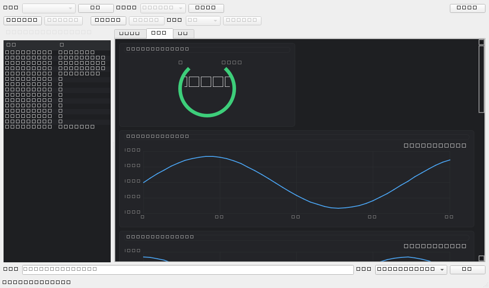

<div align="center">

# 🛠️ MCU Debug Assistant

**面向嵌入式 MCU 开发的轻量级调试助手**

串口通信 · 实时日志查看 · 设备命令控制

A lightweight debugging assistant for embedded MCU development.

[](LICENSE)
[]()
[]()
[]()

来都来了，给个Star⭐吧~

</div>

---

## 📸 界面预览



## ✨ 功能特性

- **串口连接**：自动检测 / 选择串口，波特率可设置（默认 115200），一键打开关闭
- **日志终端**：实时显示、自动滚动、一键清空，按 `[INFO]` / `[DATA]` / `[ERROR]` 分级着色
- **命令控制**：输入 `led on` 等文本命令直接下发，行尾可选（CRLF / LF / 无）
- **MCU 端 SDK**：`Debug_Init()` / `Debug_Print()` / `Debug_Printf()`，附 STM32 完整示例
- **简单文本协议**：无需 JSON / 二进制协议，串口助手即可排查问题

## 🚀 快速开始

### PC 端

```bash
pip install -r requirements.txt
python -m desktop.main
```

连接 STM32 后：点 **刷新** 选择串口 → 设置波特率 → **打开串口**，
即可实时查看 MCU 日志；在底部输入命令（如 `led on`）回车即可控制设备。

### MCU 端（STM32）

1. 将 `mcu-sdk/include` 与 `mcu-sdk/src` 加入工程编译
2. 实现 `Debug_UART_Send()`，用你的 UART 句柄发送：

```c
void Debug_UART_Send(const uint8_t *data, uint16_t len)
{
    HAL_UART_Transmit(&huart1, data, len, 100);
}
```

3. 串口初始化后调用 `Debug_Init()`，即可发送日志：

```c
Debug_Info("System Start");
Debug_Data("Temperature=%d", 25);
Debug_Error("Sensor Failed");
```

4. 命令接收（单字节中断 + 行缓冲）参考 `mcu-sdk/examples/stm32_example/main.c`

## 📡 通信协议

| 方向 | 格式 | 示例 |
|------|------|------|
| MCU → PC | `[TAG] 内容`（UTF-8，一行一条） | `[INFO] System Start` / `[DATA] Counter=10` |
| PC → MCU | 纯文本命令，一行一条 | `led on` / `motor 1000` / `pid kp 1.5` |

详细说明见 [docs/protocol.md](docs/protocol.md)。

## 📁 项目结构

```
desktop/            PC 端软件（Python + PyQt6 + pyserial）
  ├── main.py           入口
  ├── serial/           串口通信模块
  ├── parser/           日志解析模块
  └── ui/               PyQt6 界面
mcu-sdk/            MCU 端 SDK（C）
  ├── include/          mcu_debug.h
  ├── src/              mcu_debug.c
  └── examples/         STM32 示例
docs/               协议文档、截图
tests/              无硬件测试（pyserial loop:// 虚拟串口）
```

## 🧪 测试

无需硬件，使用 pyserial 自带的 `loop://` 虚拟回路串口：

```bash
python -m tests.test_serial_manager   # 串口收发
python -m tests.test_parser           # 日志解析
python -m tests.test_gui_smoke        # 界面冒烟
```

## 🗺️ 路线图

| 版本 | 规划内容 |
|------|----------|
| v0.1（当前） | 串口通信、日志查看、命令控制（Stage 1 MVP） |
| v0.2 | 标准化数据格式、数据解析 |
| v0.3 | 实时曲线、数据保存 |
| v0.5 | 配置文件、自动生成界面 |
| v1.0 | MCU SDK 完善、多设备支持、插件系统 |

## 📄 许可证

[MIT](LICENSE) © 2026 [jsrainsta](https://github.com/jsrainsta)
